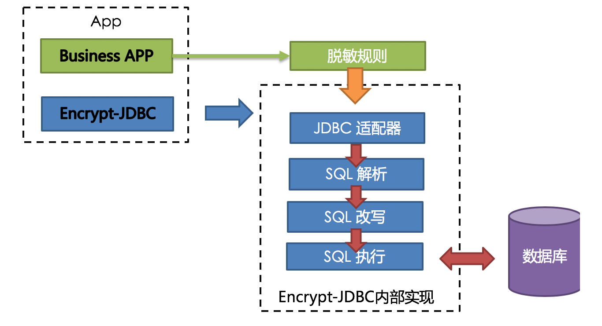
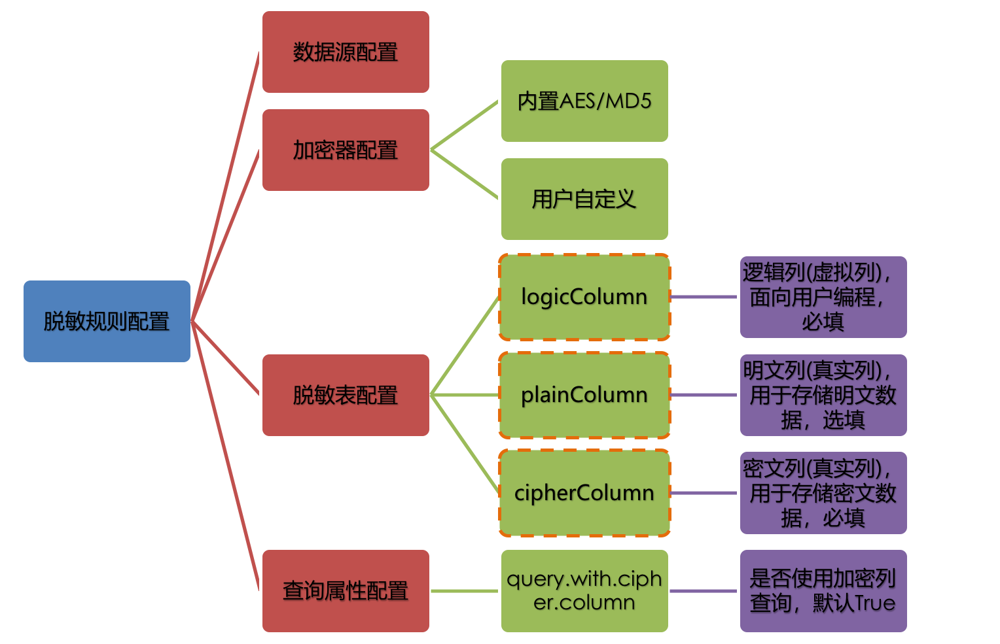
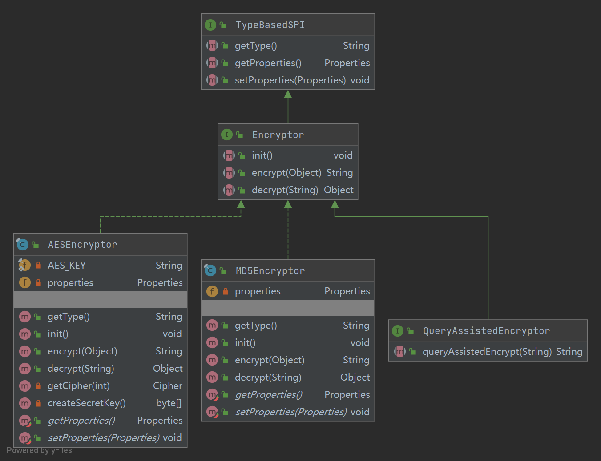

### 基于Sharding-JDBC的数据脱敏方案

#### 1. 背景

        公司现有系统存储用户数据，部分用户信息字段数据为明文数据，根据安全和法务部门要求进行整改，要求对相应数据字段进行对称加密整改，考虑到该整改数据涉及生产数据，
    且要保证争产服务正常，对用户无感知，无影响，且要保证代码尽可能的解耦，减少代码逻辑复杂性。因现系统已使用sharding-jdbc组件进行分库分表，在调研相关方案采用Sharding-jdbc提供的数据托名方案进行数据处理,特此进行整理学习。

#### 2. 原理

   Sharding-jdbc原生支持数据脱敏功能，其方案是通过其内部组件Encrypt-JDBC对SQL进行解析、改写和执行，根据相关加密类型配置自动完成数据入库时加密存储，数据出库时解密展示。
   
   - 整体架构 
    
    
   
    
    
   - 其脱敏规则如下
    
    
    
   - 数据源配置，为常规数据源配置
   - 加密器配置，Sharding-JDBC支持两种加密方式，不可逆加密MD5和AES可逆加密,同时也支持进行接口扩展。
    
   
   
   - 脱敏表模块涉及几个概念：
   
        - logicColumn: 逻辑列，是开发者自身sql中所涉及的列明，比如email
        - plainColumn: 明文列，是数据库中存储明文数据的字段为,比如email_plain
        - cipherColumn: 密文列，是数据库中存储密文数据的字段，比如email_cipher
   
   本质上就是对于程序而言，我们是以email字段作为去查询或写入数据库，Encrypt-sharding会根据具体配置来对sql进行改写，确定是用email_plain还是email_cipher去操作数据库，
   明文列和密码列是数据库实体列名，email是PO的java字段。
   - 查询属性配置：决定了使用何种规则进行数据操作，即查询时，实际查询加密字段还是明文字段。
    
#### 2.2. 方案


   安全部门要求数据加密方式为AES256,所以Encrypt-Sharding天然支持。
   - 第一阶段（增量数据脱敏）
        数据库针对密文存储数据增加email_cipher字段，设置配置，在数据插入时保证原明文数据仍旧进入email明文字段，加密内容进入email_cipher字段，数据查询获取
   仍旧以明文字段email进行查询。email_cipher字段只写不读
   - 第二阶段（存量数据脱敏）
   线下脚本进行数据脱敏清洗，针对存量数据新增加密字段数据。
   - 第三阶段（全量脱敏）
   调整Encrypt-jdbc配置，保证增量数据写入仅写加密字段email_cipher,字段查询读取也仅查询email_cipher字段，同是移除数据库email明文数据，保证数据脱敏且合规。 
#### 4. 配置

   - 第一阶段配置
```yaml
    encryptRule:
      encryptors:
        aes_encryptor:
          type: aes #加密规则采用AES
          props:
            aes.key.value: xxxxxxxxx #密钥长度确定256还是128
      tables:
        user:
          columns:
            email: #指定逻辑列
              plainColumn: email #指定明文列
              cipherColumn: email_cipher #指定密文列
              encryptor: aes_encryptor #指定加密算法
    props:
        query.with.cipher.column: false #设定查询是否查询密文列，一阶段为false
``` 
    
   - 第三阶段配置
```yaml
encryptRule:
  encryptors:
    aes_encryptor:
      type: aes
      props:
        aes.key.value: xxxxxxxxx
  tables:
    user:
      columns:
        email: 
          cipherColumn: email_cipher #仅设置密文列和逻辑列的映射
          encryptor: aes_encryptor
 props:
    query.with.cipher.column: true  #开启密文查询
``` 

#### 补充

   另外Encrypt-jdbc提供支持动态脱敏接口，即针对不同数据进行加盐处理，保证相同数据每次加密结果不同，数据查询则依赖于queryAssistedEncrypt()对称加密，且仅允许用户自行实现，无默认实现类。